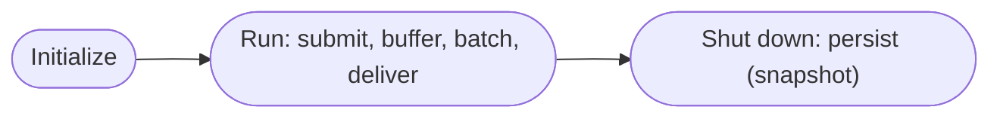
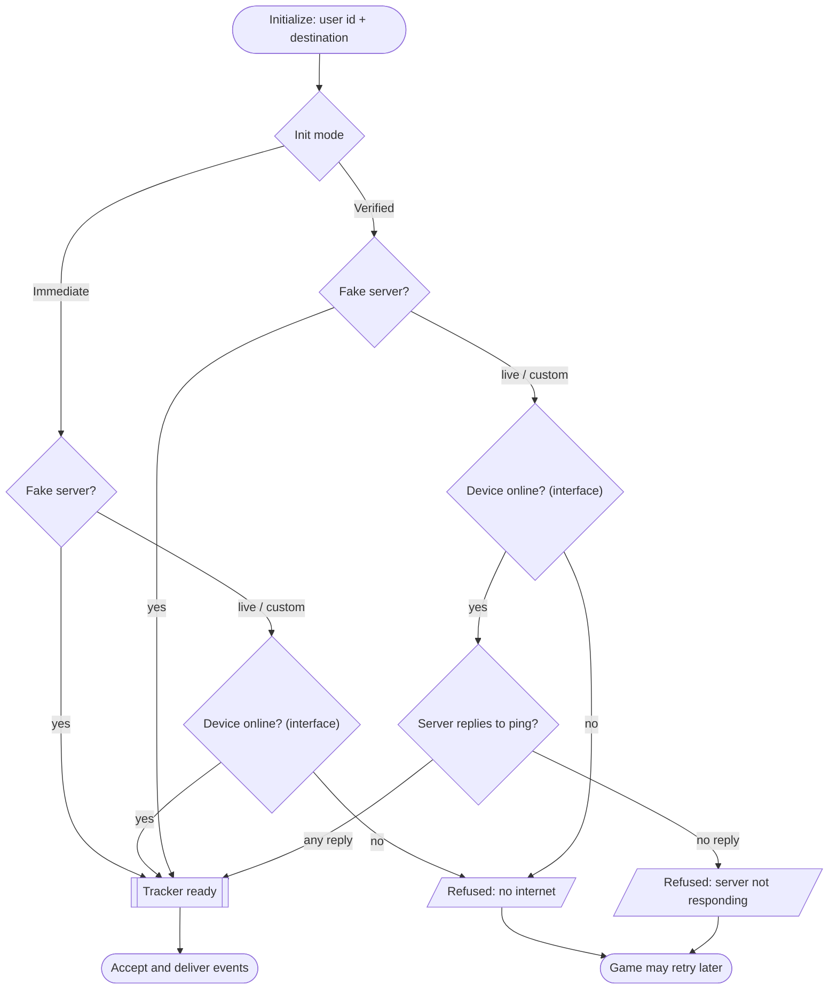
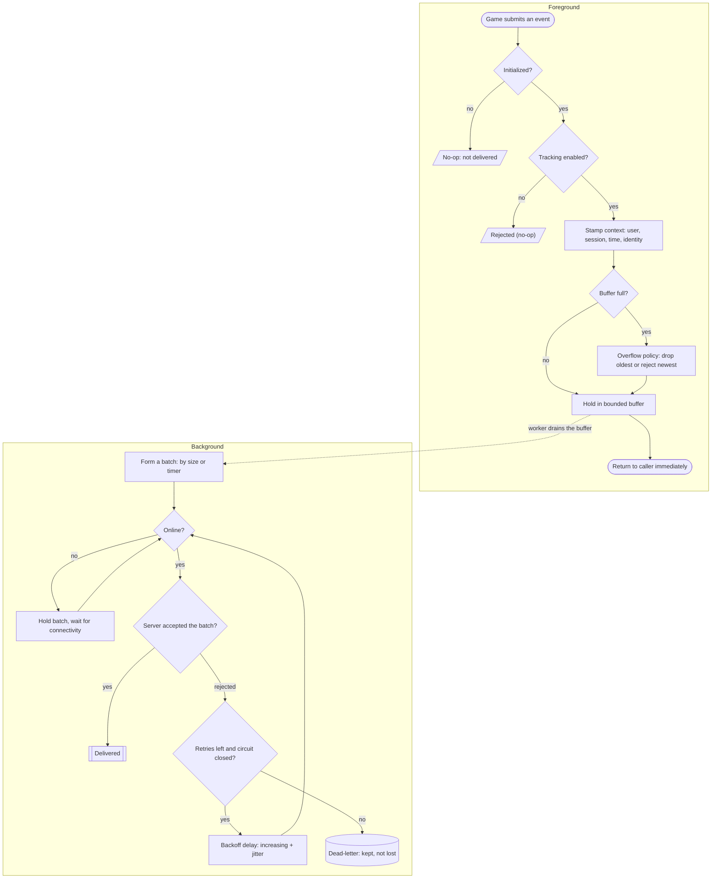
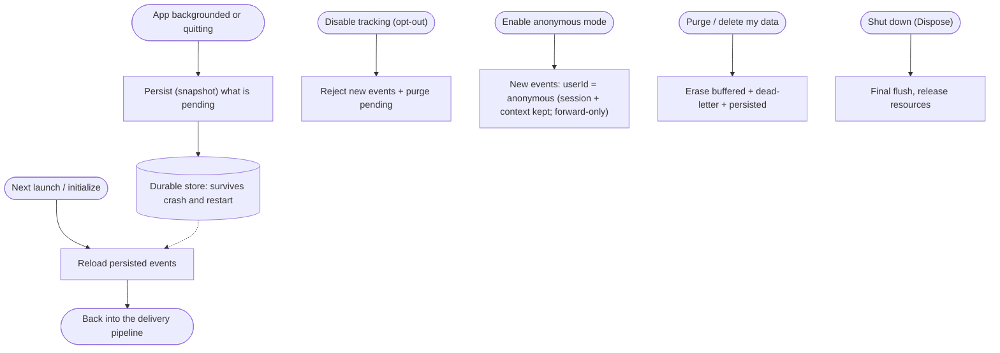

# Dmytro Udovychenko Tracking SDK — Business Logic Overview

> **What this is:** a high-level, conceptual description of *what* the SDK does and *why* — initialization,
> connectivity, the data it sends, configuration, and guarantees. It deliberately avoids code and
> implementation detail (those live in [DESIGN.md](DESIGN.md), [README.md](../../README.md), and the
> `KnowledgeBase/`). Audience: anyone who needs to understand the product behavior, not the internals.
>
> **Prefer diagrams?** The same logic as block-diagram flowcharts: [§13 Flowcharts](#13-flowcharts) (below).

---

## 1. Purpose

The SDK lets a Unity game record **events** ("the player did X") and reliably deliver them to a tracking
server — **without ever blocking gameplay and without losing data** when the network is flaky or the app is
killed. The value is not the tiny API; it's the **pipeline and guarantees behind it**: buffering, batching,
retries, offline tolerance, durability, and privacy controls.

The calling code does two things: **initialize once**, then **send events**. Everything else (when to send,
how to batch, what to retry, what to persist) is handled internally.

---

## 2. Key concepts

| Concept | Meaning |
| ------- | ------- |
| **Event** | One recorded thing — either a simple **message** (a string) or a **structured map** (key/value data). |
| **User** | Who the events belong to. Provided once at initialization; stamped on every event. |
| **Session** | One continuous run of the app. A session id is generated at initialization and stamped on every event, so events from the same launch can be grouped. |
| **Destination (server)** | Where events are delivered. Chosen at initialization (a named environment or a custom address). |
| **Tracker** | The single front door the game talks to. Initialized once, then used for the whole session. |

---

## 3. The big picture (lifecycle)

```
initialize  →  (running: accept events → buffer → deliver)  →  shut down
```

1. **Initialize** — say who the user is and where events go. Optionally confirm the destination is reachable.
2. **Running** — the game submits events; the SDK buffers and delivers them in the background.
3. **Shut down** — on quit (or on demand) the SDK persists (snapshots) what's pending and releases resources.

---

## 4. Initialization

The game initializes the tracker with **two decisions**: *who* the events belong to (a required user id) and
*where* they go (the destination).

**Destinations:**

| Destination | Behavior |
| ----------- | -------- |
| **Fake server** | Offline simulation — no real network. Used for local dev and tests; always "succeeds". |
| **Fake server (chaos)** | Offline simulation that injects ~20% transient failures — exercises the reliability paths (retries / circuit breaker / dead-letter) without a real server. |
| **HTTP test server** | The real, live test receiver (stub) over HTTP. |
| **HTTP test server (chaos)** | The same receiver in a fault-injecting mode (`?fail=20` → ~20% transient 503s). |
| **Custom address** | Any explicit server address. |

**Two ways to initialize:**

- **Immediate** — initializes right away. A cheap, local network-interface check decides whether to proceed.
- **Verified (recommended for live servers)** — first **confirms the destination server actually answers**,
  then initializes only if it does (see §5). The fake server skips this check entirely.

If initialization is refused (no connectivity / server unreachable), the tracker simply does **not** come up
and reports that outcome; the game can retry later — this connectivity-refusal path never throws. (A
blank/empty `userId` is a setup-time programmer error and *does* throw `ArgumentException`; that is distinct
from the runtime hot path, which never throws into game code.)

---

## 5. Connectivity checks

Because a tracker pointed at an unreachable server would buffer events that can never be delivered, the
verified initialization checks connectivity in two escalating stages:

1. **Is the device online?** — a fast, local check of the network interface (Wi-Fi / cellular). If the
   device is clearly offline, fail fast with a "no internet" outcome — no network call is made.
2. **Does the server answer?** — a lightweight ping to the destination. **Any reply from the server counts
   as reachable** (even a "method not allowed" reply) — that proves the server is alive and reachable. Only
   a timeout or a connection failure counts as "server not responding".

Outcomes are distinct so the cause is clear: **no internet** vs **server not responding**. The **fake
server** skips both stages (it represents an intentional offline mode).

> Note: this is an *availability* check at startup. Transient server hiccups during normal operation are
> handled separately by the delivery reliability rules (§8), not by blocking initialization.

---

## 6. What data is sent

**Event kinds the game submits:**

- **Message** — a single text string.
- **Structured map** — a set of key/value fields describing a richer event.

**Automatic context** added to every event (the game doesn't supply these):

- **Who** — the user id (or the constant `anonymous` in privacy mode, §10).
- **When** — a timestamp.
- **Which session** — the session id.
- **Where** — coarse, non-identifying runtime context: platform, app version, device model, OS version,
  network type (wifi/cellular/none), timezone (UTC offset), locale, and bundle id. **Never** a stable device
  id, advertising id, IP, location, or carrier.
- **A stable event identity** — used to recognize the same event across retries (see §7).

**How it travels:** events are not sent one-by-one. They are **collected into batches** and delivered
together, which is far more efficient. A batch is sent when it fills up or after a short waiting period,
whichever comes first. The server receives a batch as a structured payload and acknowledges success.

---

## 7. Delivery guarantees

- **Non-blocking** — submitting an event returns immediately; delivery happens in the background. Gameplay
  is never stalled by the network.
- **At-least-once** — an event is retried until it is delivered or definitively given up. It may, in rare
  failure windows, be delivered more than once.
- **Idempotency** — because each event carries a stable identity, a server can recognize and de-duplicate a
  repeat of the same event. (At-least-once + idempotency together approximate exactly-once.)
- **Batched** — events are grouped for efficient delivery.

---

## 8. Reliability behaviors

The pipeline is built to survive bad networks and abrupt shutdowns:

- **Buffering with a bound** — events wait in a bounded in-memory buffer. If the game produces events faster
  than they can be sent and the buffer fills, an **overflow policy** decides what gives way (drop the oldest,
  or reject the newest) — memory is never allowed to grow without limit.
- **Offline hold** — while the device is offline, events are held (not thrown away) and delivered once
  connectivity returns.
- **Retries with backoff** — failed deliveries are retried with increasing, jittered delays, up to a limit,
  so a struggling server isn't hammered.
- **Circuit breaker** — after repeated failures the SDK briefly stops trying, then probes again — avoiding a
  storm of doomed requests during an outage.
- **Dead-letter** — events that exhaust their retries are set aside (not silently lost) for inspection or
  later replay.
- **Durability** — pending events are persisted to durable storage, so they survive an app restart or crash.
- **Lifecycle persistence** — when the app is backgrounded or quits, the SDK persists (snapshots) what's pending so the
  tail of a session isn't lost.

---

## 9. Configuration

Behavior is tunable through a single configuration surface, with sensible production defaults. Conceptually,
the knobs cover:

- **Identity & destination** — user id, destination server / address.
- **Batching** — batch size, how long a partial batch waits before being sent.
- **Buffering** — buffer capacity, overflow policy (drop oldest vs reject newest).
- **Retries** — maximum attempts, initial delay, maximum backoff delay.
- **Circuit breaker** — failure threshold, cooldown duration.
- **Dead-letter** — capacity.
- **Timeouts** — per-request delivery timeout, connectivity-check timeout.
- **Master switch** — tracking enabled / disabled (privacy, §10).
- **Anonymous mode** — start anonymized or not; flippable at runtime (privacy, §10).

Defaults are production-ready, so a one-line initialization is enough for most cases.

---

## 10. Privacy & data control

- **Opt-out** — tracking can be turned off at any time. While disabled, the SDK accepts nothing **and purges**
  whatever is pending (buffer, dead-letter, persisted).
- **Anonymous mode** — a separate switch that keeps collecting but **drops the user identity**: events leave
  with the user id replaced by the constant `anonymous`, while the session id, device context, and payload
  still flow. Flippable at runtime to react to consent changes. **Forward-only** — events already buffered
  under the real identity still deliver as collected (use opt-out + erase to remove pending data).
- **Erase** — buffered, dead-lettered, and persisted data can be purged on demand (supports "delete my
  data" requirements).
- **No surprise collection** — only what the game explicitly submits, plus the documented automatic context
  (§6), is ever sent. No stable device id, advertising id, IP, or location is collected.

---

## 11. Observability

- **Metrics** — live counters expose how the pipeline is doing: events accepted, delivered, dropped,
  retried, given up, dead-lettered.
- **Logging hook** — all SDK diagnostics flow through a single hook the host app can route into its own
  logging (or silence). The SDK never writes to the console directly.
- **Dead-letter inspection** — give-up events are inspectable rather than lost.

---

## 12. Behavior at a glance (failure modes)

| Situation | What the SDK does |
| --------- | ----------------- |
| Send before initialization | No-op; reports "not delivered". Never throws, never hangs. |
| No internet at verified init | Initialization is refused with a "no internet" outcome; game can retry later. |
| Server unreachable at verified init | Initialization is refused with a "server not responding" outcome. |
| Device goes offline while running | Events are held and delivered when connectivity returns. |
| Server returns transient errors | Retries with backoff; circuit breaker if it persists. |
| Retries exhausted for an event | Moved to the dead-letter set (not silently dropped). |
| Buffer full | Overflow policy applies (drop oldest / reject newest); memory stays bounded. |
| App backgrounded or quit | Pending events are persisted (snapshotted); survive restart. |
| Tracking disabled (opt-out) | New events are rejected; pending data is purged. |
| Anonymous mode on | New events leave with user id `anonymous`; session id, device context, and payload still flow; already-buffered identified events still deliver. |

---

## 13. Flowcharts

The same business logic as block-diagram flowcharts (Mermaid — renders on GitHub and most Markdown viewers).
High-level only, no implementation.

> **Shapes:** `(stadium)` = start/end · `[rectangle]` = operation · `{diamond}` = decision ·
> `[(cylinder)]` = durable storage · `[[box]]` = ready/terminal-good · `[/parallelogram/]` = refused/output.

### Big picture



### Initialization and connectivity

Two init modes: **Immediate** (a cheap local network-interface check only) or **Verified** (also pings the
server first — recommended for live servers). The fake server skips every check in both modes. A refused init
never throws — the game can retry later. **Destinations:** *fake server* (clean / chaos) — simulated, no
network, always comes up · *HTTP test server* (clean / chaos) — real network, needs connectivity · *custom
address* — real network. The **chaos** variants inject ~20% transient failures to exercise the delivery
reliability paths (see the pipeline below).



*Immediate init does only the interface check (no ping) — transient hiccups are handled later during delivery,
not by blocking init. Verified init adds the ping: any reply (even "method not allowed") proves the server is
reachable; only silence (timeout / no route) means "server not responding".*

### Event delivery pipeline

Submitting an event is **instant and never blocks** the game (foreground). A background worker drains the
buffer, batches events, and delivers them with retries, offline-hold, a circuit breaker, and a dead-letter
safety net.



**What tunes each step:** batch size and flush timer (batching) · buffer capacity and overflow policy
(buffering) · max attempts and delays (retries) · failure threshold and cooldown (circuit breaker) ·
request timeout (delivery).

### Durability, lifecycle and privacy

Pending events survive backgrounding, crashes and restarts; the player can opt out, go anonymous, or erase their data.



### Guarantees the picture encodes

- **Non-blocking** — submit returns immediately; everything after the buffer is background work.
- **No silent loss** — events are buffered, held while offline, retried, persisted, and (if they truly fail)
  dead-lettered — never dropped without a recorded reason.
- **At-least-once + idempotency** — retried events carry a stable identity, so the server can de-duplicate.
- **Bounded** — the buffer has a hard cap; the overflow policy keeps memory in check.
- **Honest init** — Verified init only comes up against a server that actually replies; Immediate init at least
  requires the device to be online (HTTP targets are refused while offline).

---

*High-level only. For design rationale see [DESIGN.md](DESIGN.md); for the public API and architecture see
[README.md](../../README.md).*
